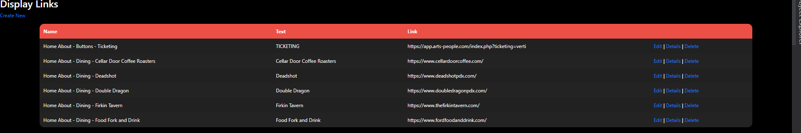
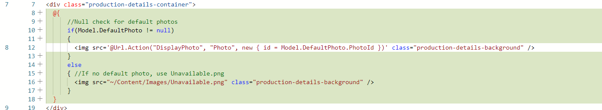
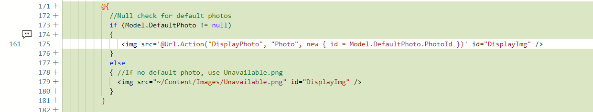
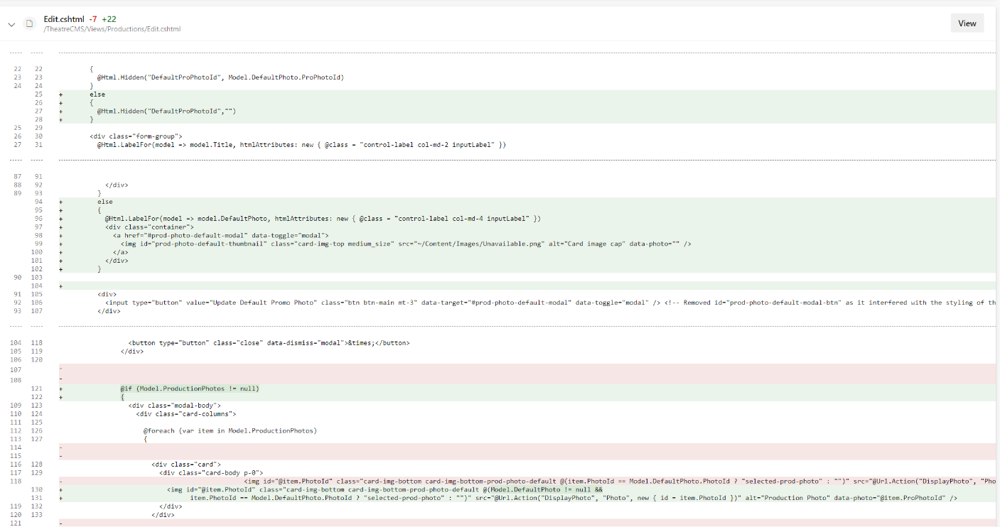
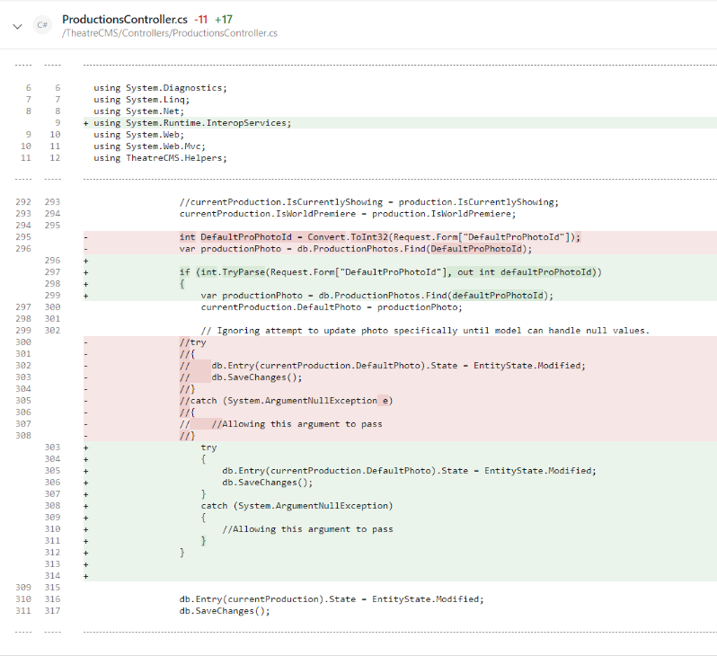

# Theatre-Project

- [Introduction](#Introduction)
- [Front-End](#Front-End)
- [Back-End](#Back-End)
  

## Introduction
At The Tech Academy, I was trained in C#, HTML, CSS, JavaScript, SQL, Git, Agile. I worked remotely on an ongoing live project to build a website, utilizing C# ASP.NET MVC framework, for a Portland theatre. In this project, we used C#, LINQ, JavaScript, HTML and CSS to create the front-end and back-end. We used the Agile method in two weeks sprint to manage the project life cycle. It was a great experience working with an amazing group of instructors and colleagues on a full functional website.  
  
Although the website's construction has been in progress for a while, it still has a great deal of functions and user interface features that needed to be implemented. Everybody chose the task they wanted to work. I assigned myself various stories on the front end and back end: fixing bugs, redesign a display table, added a new display feature for the project.  
  
Throughout this project, I was trained to become better at technical problem solving, communication, and flexibility. The following is a short summary of my code snippets to represent some of what I contributed to the project.  
  
## Front-End
The following picture shows the user interface that I added for the Favorite Cast Member section in which the user is able to view all the cast member he/she has liked.  
  
  

Another task that I accomplished was to redesign the display links table. Attached is the before and after images.  

    

## Back-End
I coded some entity framework queries to get data from the database to give to the view. I also fixed a few null exception bugs on the project. I created the initial view and controller for a new section of the website.
Here is some examples related to the back-end.  
  
Null Reference Check - Story 6602
  
  

  
Null Reference Check - Story 7362

[Top](#Theatre-Project)
