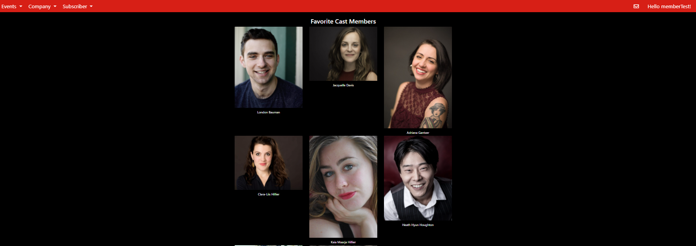
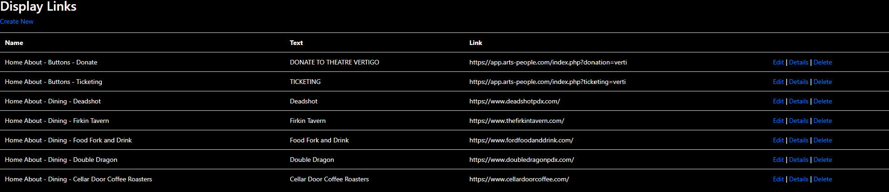

# Theatre-Project

- [Introduction](#Introduction)
- 

## Introduction
At The Tech Academy, I was trained in C#, HTML, JavaScript, SQL, Git, Agile. I had worked remotely on a ongoing live project to build a website utilized C# ASP.NET MVC framework  for a local theatre. In this project, we used C#, LinQ, JavaScript, HTML to create front-end and back-end, utilized Agile method in two weeks sprint to manage the project life cycle. It was a great experience working with an amazing group of instructors and colleagues on a high functional website.  
  
Although the website has been built for a while, it still has a great deal of functions and user interface features needs to be implemented. Everybody chose to take on what they were comfortable. I assigned myself some user stories on front end and back end: fixing bugs, redesign a display table, added a new display feature for the project.  
  
Throughout this project, I was trained to better at technical problem solving, communication, and flexibility. Following is a short summary of my code snippets to present what I have done on the project.  
  
## Front-End
The following picture is the user interface that I added for the Favorite Cast Member section in which the user is able to view all the cast member he/she liked.  
  
  

Another task that I accomplished was to redesign the display links table. Attached is the before and after images.  

   
